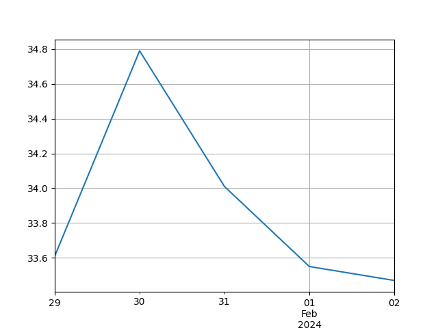

# financial-timeseries

## Introduction

A Python3 module that utilises the Pandas, MatPlotLib, and Numpy libraries, and [Stooq](https://stooq.com/db/) and Nasdaq free data APIs, to demonstrate 'panel data' timeseries analysis of stock data.

- **Time series:** Sequence of numerical data points representing successive, equally spaced points in time, e.g. stock price at regular intervals (presented on a blotter where: price on x-axis; date on y-axis.)

***MapPlotLib of Bank of America timeseries for 5 days from 29 Jan 2024 to 2 Feb 2024:***

## Long-term

- **Environment:** With requirements.txt etc..
- **FastAPI (or Flask):** Present this as an microservice that can be queried by a UI, etc..
- **Algorithimic trading simulation:** Buying/selling when the price goes above/below a set threshold (determined by algorithm.)
- **Backtesting:** Running the algorithms against past data to see if they are successful (to reduce risk of utilisation of said algorithms to predict future stock movements.)
- **UI:** Rather than Jupyter Notebook, present asynchronously via a dashboard built on Angular/React (that queries a FastAPI/Flask microservice.)

## Stack

- Python3
- Pandas (panel data) library
- MatPlotLib
- Numpy

## Data Sources

- [Stooq](https://stooq.com/db/)

## How to Run

`` python3 script.py ``