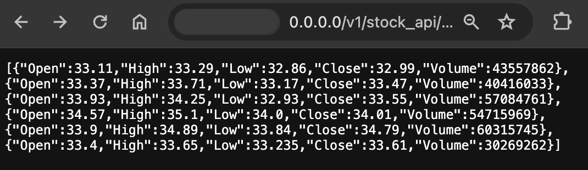

# financial-timeseries

***MapPlotLib of Bank of America time series for 5 days from 29 Jan 2024 to 2 Feb 2024:***

## Introduction

A Python3 FastAPI app that utilises Pandas, MatPlotLib, and Numpy (libraries), to process data fetched from [Stooq](https://stooq.com/db/) and the [Nasdaq API](https://data.nasdaq.com/tools/python).

### Aim: 
To demonstrate 'panel data' time series analysis of stock data.

### Stack

- Python3
- Pandas (panel data) library
- MatPlotLib
- Numpy

### Data Sources

- Via Panda's DataReader: [Stooq](https://stooq.com/db/).  (*Also: Tiingo • IEX • Alpha Vantage • Econdb • Enigma • Quandl • St.Louis FED (FRED) • Kenneth French’s data library • World Bank • OECD • Eurostat • Thrift Savings Plan • Nasdaq Trader symbol definitions • MOEX • Naver Finance • Yahoo Finance*)
- [Nasdaq API](https://data.nasdaq.com/tools/python)

## Current Features: 

- **Time series:** Sequence of numerical data points representing successive, equally spaced points in time, e.g. stock price at regular intervals (presented on a blotter where: price on x-axis; date on y-axis.)
- **Environment:** VirtualEnv, with requirements.txt etc..
- **FastAPI (or Flask):** As an microservice that can be queried by a UI, etc..

## Long-term Objectives

- **Deploy as a Firebase function or a AWS Lambda** (SAM API, etc., and even potentially as multiple lambdas functions.)
- **Algorithimic trading simulation:** Buying/selling when the price goes above/below a set threshold (determined by algorithm.)
- **Backtesting:** Running the algorithms against past data to see if they are successful (to reduce risk of utilisation of said algorithms to predict future stock movements.)
- **UI:** Rather than Jupyter Notebook, present asynchronously via a dashboard built on Grafana/ELK, or even Angular/React (that queries a FastAPI/Flask microservice.)

## Endpoints

**Get a time series:** 

`` /v1/stock_api/time_series/[x]/[y]/[z] `` 

Where:
- x: stock name (abbreviation), e.g. 'BAC' (Bank of America)
- y: data source, e.g. Stooq
- z: how many days back to include in the series

E.g. (local machine) for a Stooq-supplied Bank of America time series beginning from 7 days ago:
`` http://0.0.0.0/v1/stock_api/time_series/BAC/stooq/7 `` 

## How to Run

`` uvicorn timeseries_processor.src.app:app --reload --host 0.0.0.0 --port 80 ``
